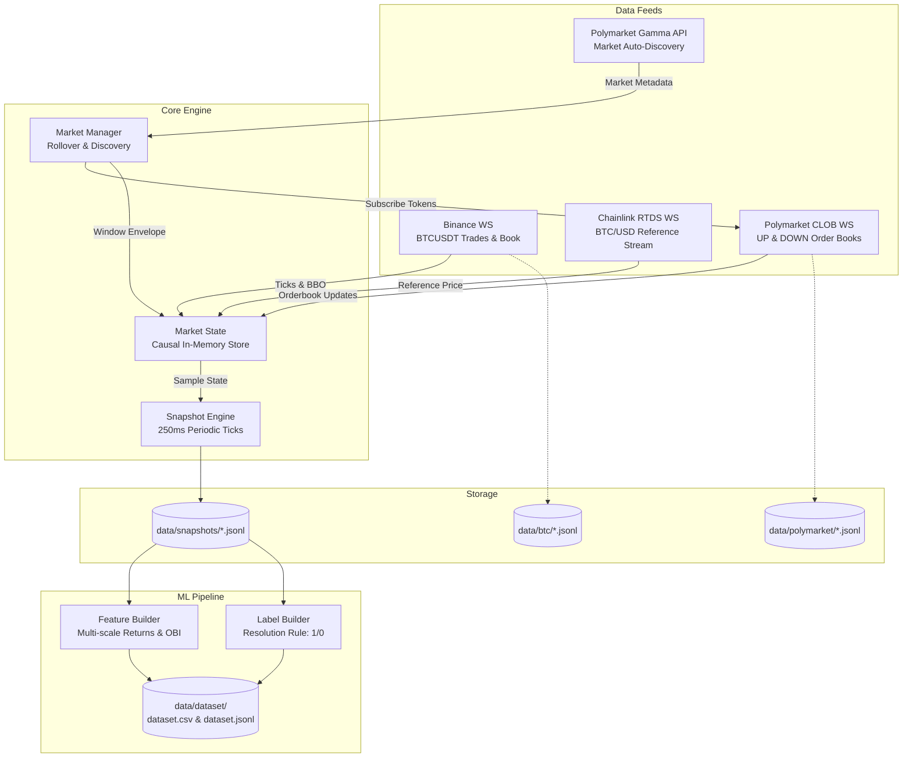

# updown-5m-predictor 🚀

> **High-Frequency Data Collector, Feature Pipeline & ML Models for Polymarket BTC Up/Down 5m Markets**

[](https://www.typescriptlang.org/)
[](https://nodejs.org/)
[](https://vitest.dev/)
[](LICENSE)

`updown-5m-predictor` is a high-frequency data collector and feature engineering pipeline built specifically to train **Neural Network / Machine Learning** models that predict the binary outcome (**UP / DOWN**) of the 5-minute **BTC Up/Down** markets on **Polymarket**.

> [!NOTE]
> This project is intended purely for quantitative research and dataset generation. The system does not execute live trades (*no trading execution*).

---

## 📑 Table of Contents

- [Key Features](#-key-features)
- [System Architecture](#-system-architecture)
- [Dataset Features & Schema](#-dataset-features--schema)
- [Project Structure](#-project-structure)
- [Getting Started](#-getting-started)
  - [Prerequisites](#prerequisites)
  - [Installation](#installation)
  - [Configuration](#configuration)
- [CLI Commands](#-cli-commands)
- [Python / PyTorch Integration](#-python--pytorch-integration)
- [Unit Tests](#-unit-tests)
- [License](#-license)

---

## ✨ Key Features

- **Multi-Source Real-time Streaming**:
  - **Binance WebSocket Feed**: Captures trade ticks and `bookTicker` orderbook updates for BTCUSDT in real time.
  - **Chainlink RTDS Feed**: Captures the Chainlink BTC/USD reference price stream directly via the Polymarket RTDS WebSocket (the official resolution reference for Polymarket markets).
  - **Polymarket CLOB Feed**: Captures the full-depth orderbook, quote changes, and last trade price for the UP and DOWN outcome tokens.
- **Automated Market Discovery & Seamless Rollover**:
  - Automatically detects the active 5-minute market window via the Polymarket Gamma API (`btc-updown-5m-<timestamp>`).
  - Supports automatic window transitions (*zero-gap rollover*) with no interruption.
- **Synchronized Causal Snapshot Engine**:
  - Produces unified multi-source snapshots every 250ms (4 samples/second).
  - Strictly causal by design: no future data leakage (*zero look-ahead bias*).
- **Comprehensive Feature Builder**:
  - Multi-scale BTC returns (1s, 5s, 15s, 60s, 300s).
  - Realized volatility over rolling windows (5s, 15s, 60s).
  - Order Book Imbalance (OBI) for the UP & DOWN tokens, plus market spread.
  - Cross-market basis ($P_{\text{Chainlink}} - P_{\text{Binance}}$).
  - Polymarket implied probability & spread-sum inefficiency.
  - Time normalization (seconds remaining and fraction of the window elapsed).
- **Official Resolution Label Builder**:
  - Labels the binary target (`1 = UP`, `0 = DOWN`) by comparing the Chainlink price at the start vs. the end of the 5-minute window, following Polymarket's resolution rules.
- **Ready-to-Use Exports**:
  - Exports directly to `.csv` and `.jsonl`, ready to load with Pandas, Polars, or a PyTorch DataLoader.

---

## 🏛️ System Architecture



---

## 📊 Dataset Features & Schema

Each row in the dataset (`dataset.csv` / `dataset.jsonl`) contains the following features:

| Category | Column Names | Description |
| :--- | :--- | :--- |
| **Identification** | `timestampMs`, `timestampUtc`, `slug`, `conditionId`, `sequence` | Snapshot and market window metadata |
| **Time** | `secondsRemaining`, `fractionElapsed` | Seconds until close and window maturity ratio $(0.0 \to 1.0)$ |
| **BTC Price & Returns** | `btcPrice`, `btcReturn1s`, `btcReturn5s`, `btcReturn15s`, `btcReturn60s`, `btcReturn300s` | Multi-scale relative price returns: $\frac{P_t - P_{t-\Delta t}}{P_{t-\Delta t}}$ |
| **BTC Volatility** | `btcVol5s`, `btcVol15s`, `btcVol60s` | Realized volatility (standard deviation of returns) over rolling windows |
| **BTC Orderbook** | `btcBid`, `btcAsk`, `btcSpread`, `btcMid` | Binance bid/ask quotes and spot spread |
| **BTC Volume** | `btcVolumeDelta5s`, `btcBuySellRatio`, `btcNetVolume` | 5-second volume delta, aggressive buy order ratio, and net buy-sell difference |
| **Chainlink Reference Feed** | `chainlinkPrice`, `chainlinkReturn5s`, `chainlinkReturn15s`, `chainlinkBinanceBasis` | Chainlink index price and its divergence basis versus Binance |
| **Polymarket UP** | `upBid`, `upAsk`, `upMid`, `upSpread`, `upBidSize`, `upAskSize`, `upOrderBookImbalance`, `upLastTradePrice` | Orderbook microstructure of the UP token $(\text{OBI} \in [-1, 1])$ |
| **Polymarket DOWN** | `downBid`, `downAsk`, `downMid`, `downSpread`, `downBidSize`, `downAskSize`, `downOrderBookImbalance`, `downLastTradePrice` | Orderbook microstructure of the DOWN token |
| **PM Market Signals** | `upDownSpreadSum`, `pmImpliedProbUp` | Sum of UP+DOWN mid-prices and the market-implied probability estimate |
| **Target / Label** | `target`, `label`, `windowLabelRule`, `windowStartPrice`, `windowEndPrice` | **Binary target (`1 = UP`, `0 = DOWN`)**, resolution rule, start price, and end price |

---

## 📁 Project Structure

```text
updown-5m-predictor/
├── data/                       # Data storage directory (git-ignored)
│   ├── btc/                    # Raw Binance JSONL feed
│   ├── polymarket/             # Raw Polymarket CLOB JSONL feed
│   ├── snapshots/              # Synchronized 250ms snapshots
│   └── dataset/                # ML dataset output (CSV & JSONL)
├── src/
│   ├── cli/
│   │   ├── dataset-build.ts    # CLI to extract features & build the dataset
│   │   └── validate.ts         # CLI to check JSONL data integrity
│   ├── collectors/
│   │   ├── btc/                # Binance & Chainlink RTDS feed collectors
│   │   └── polymarket/         # CLOB feed collector & Gamma API discovery
│   ├── config/                 # Application configuration via env
│   ├── dataset/
│   │   ├── dataset-builder.ts  # Dataset aggregation & exporter
│   │   ├── feature-builder.ts  # Technical feature computation engine
│   │   └── label-builder.ts    # Resolution label logic (1 / 0)
│   ├── engine/
│   │   ├── market-manager.ts   # Market lifecycle management & rollover
│   │   ├── market-state.ts     # Causal in-memory state
│   │   ├── snapshot-engine.ts  # Periodic multi-source snapshot timer
│   │   └── stats.ts            # Console metrics & performance reporter
│   ├── storage/                # JSONL file rotator & error handling
│   ├── types/                  # TypeScript interface & type definitions
│   ├── utils/                  # Logger, websocket connection, & calculation utilities
│   └── index.ts                # Data collector entrypoint
├── ml/                         # Python ML pipeline (see ml/README.md)
│   ├── models/                 # PyTorch Residual MLP architecture
│   ├── dataset.py              # Data loading, preprocessing & chronological split
│   ├── train_baseline.py       # LightGBM & Logistic Regression benchmarks
│   ├── train_nn.py             # PyTorch training loop
│   ├── evaluate.py             # Metrics & simulated edge vs. market odds
│   ├── predict.py              # Real-time inference script
│   └── requirements.txt        # Python dependencies
├── tests/                      # 54 Vitest unit tests (100% passing)
├── .env.example                # Example environment configuration
├── eslint.config.js
├── LICENSE
├── package.json
└── tsconfig.json
```

---

## 🚀 Getting Started

### Prerequisites

- **Node.js**: Version `>= 20.0.0`
- **npm**: Version `>= 9.0.0`

### Installation

1. Clone the repository to your local machine:
   ```bash
   git clone https://github.com/fahri-05/updown-5m-predictor.git
   cd updown-5m-predictor
   ```

2. Install dependencies:
   ```bash
   npm install
   ```

### Configuration

Copy the example configuration file `.env.example` to `.env`:

```bash
cp .env.example .env
```

All WebSocket and REST API endpoints used are public. **No API key or secret is required**. The default settings are ready to use out of the box.

---

## 🛠️ CLI Commands

| Command | Description |
| :--- | :--- |
| `npm run dev` | Runs the live data collector in real time via `tsx` |
| `npm run validate` | Validates the JSON format and timestamp consistency of JSONL data |
| `npm run dataset:build` | Builds the tabular dataset (`dataset.csv` & `dataset.jsonl`) from snapshots |
| `npm test` | Runs all unit tests using `vitest` |
| `npm run typecheck` | Runs TypeScript static type checking (`tsc --noEmit`) |
| `npm run lint` | Runs the code linter using `eslint` |

---

## 🧠 Python / PyTorch Integration

Once the dataset has been built with `npm run dataset:build`, you can train Machine Learning or Deep Learning models directly in Python. The repository also ships a ready-made training pipeline (LightGBM baseline and a PyTorch Residual MLP) in [`ml/`](ml/README.md). A minimal example:

```python
import pandas as pd
import torch
import torch.nn as nn
from torch.utils.data import DataLoader, TensorDataset

# 1. Load the dataset
df = pd.read_csv("data/dataset/dataset.csv")

# 2. Separate feature columns and target
excluded_cols = [
    'timestampMs', 'timestampUtc', 'slug', 'conditionId', 'sequence',
    'target', 'label', 'windowLabelRule', 'windowStartPrice', 'windowEndPrice'
]
feature_cols = [c for c in df.columns if c not in excluded_cols]

X = df[feature_cols].values
y = df['target'].values

print(f"Feature Shape (Samples, Features): {X.shape}")
print(f"Target Distribution: UP = {y.mean():.2%}, DOWN = {1 - y.mean():.2%}")

# 3. Convert to a PyTorch DataLoader
tensor_x = torch.tensor(X, dtype=torch.float32)
tensor_y = torch.tensor(y, dtype=torch.float32).unsqueeze(1)

dataset = TensorDataset(tensor_x, tensor_y)
loader = DataLoader(dataset, batch_size=64, shuffle=True)
```

---

## 🧪 Unit Tests

All components ship with comprehensive unit tests using **Vitest**:

```bash
npm test
```

```text
 Test Files  10 passed (10)
      Tests  54 passed (54)
```

Test coverage includes:
- Market auto-discovery handling and Polymarket API stringified JSON.
- File rotation and the JSONL writer queue.
- Automatic window rollover transitions and token pre-subscription.
- Mathematical validation of order book imbalance, spread, volatility, and lagged returns.
- Ground-truth label determination based on Chainlink & Binance prices.

---

## 📄 License

This project is licensed under the [MIT License](LICENSE).
